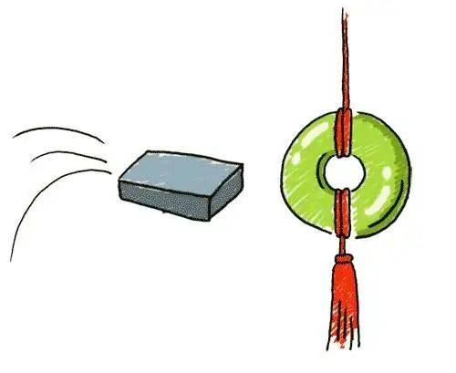
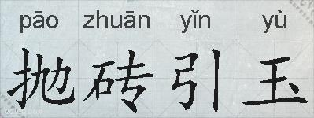
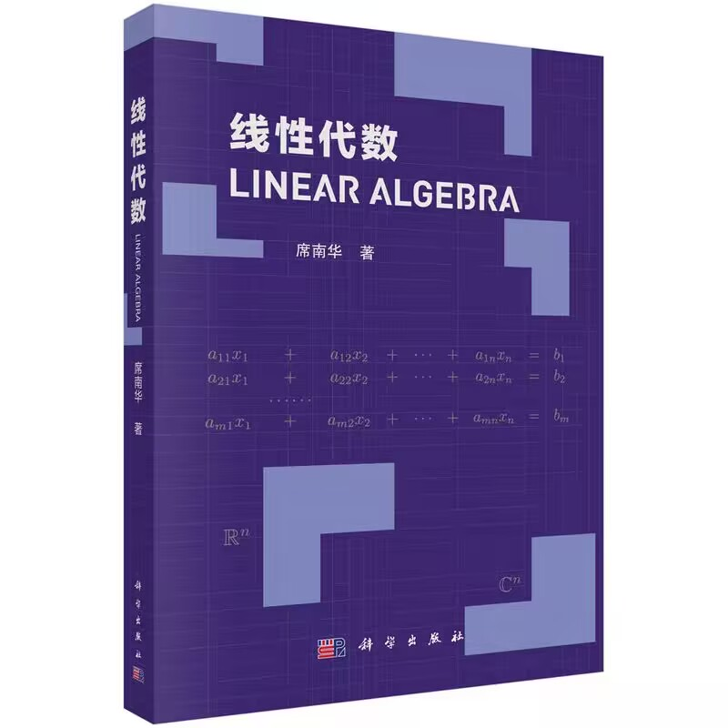
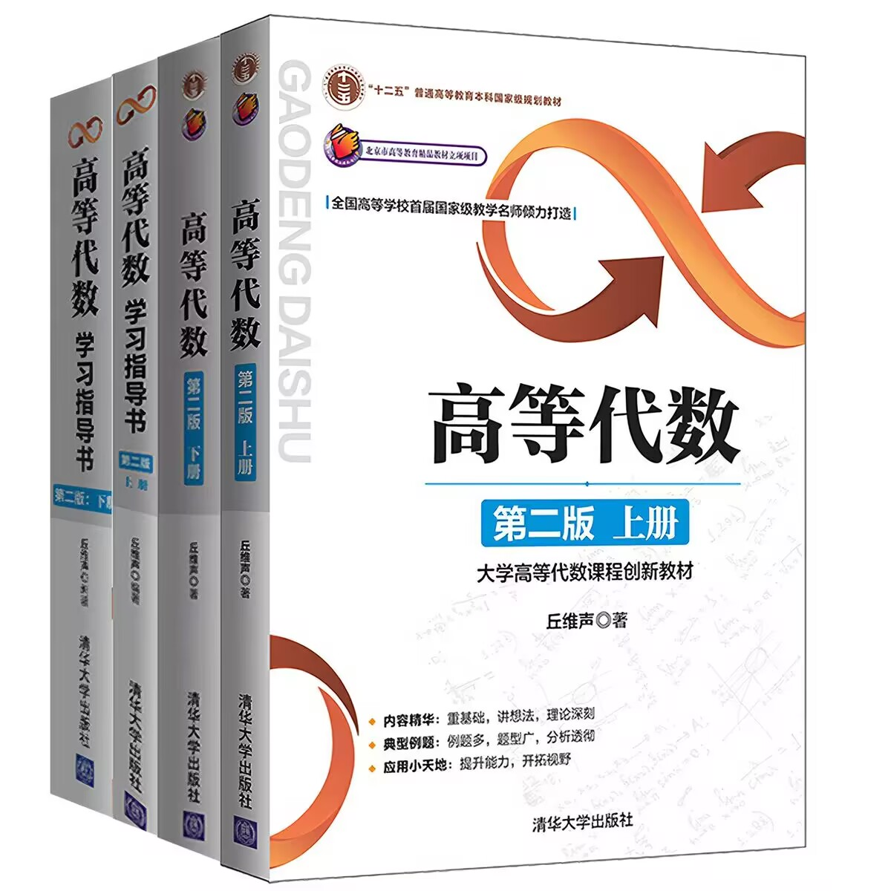
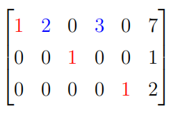
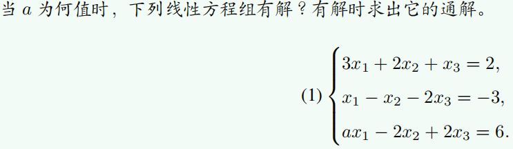
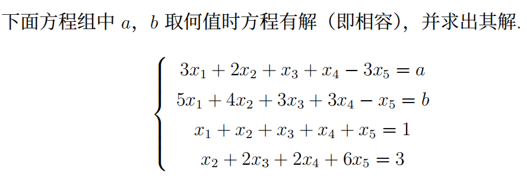

# 线性代数习题课 1
2026.9.21

---

---

to offer one's own relatively worthless words, opinions, or services in order to attract others' more valuable contributions

---
## Reasons Why You Should NOT Take This Lecture/Recitation
- your TA is an absolute beginner, just like many of you
- this course is very demanding — no easy credits here
- this course is nothing like what you learned in high school
- this course follows a distinctive curriculum — with few directly comparable courses at other universities in China.

Despite all these drawbacks, you can still **make great progress** if you **work hard** throughout this course

---

# Self-Introduction
- 李岷璨
- 23级数所 本科生
- QQ: 2661202177
- Wechat: lonelyplanet4869
- Email: limc2023@shanghaitech.edu.cn

---
# Textbook & Reference Book

  

    
    
教材（最重要的资料）

  

  

    
    
参考用书（按需使用）

  

---
# About Recitation
- 时间：每周一18:00~18:45, 18:55~19:40（可灵活调整）
- 地点：信息学院1A108

1. ~~交作业~~
  在 Gradescope 上提交作业 (Entry Code: 8YEPN3)
  习题课不设考勤，可以不来
  考核方式：平时成绩 30%（作业 20% & 小测 10%）；
  期中考试 30%；期末考试 40%
2. 讲解部分上次作业题目
3. 回顾上周正课重难点知识
4. 其他讨论（例如同学们提出的有意思的问题，建议提前发给我）

---

# About Homework
- **禁止抄袭!**
- 主要按完成度给分
- 手写过程
- 鼓励讨论交流
- 合理使用AI，注意谨慎求证
- 可随时与我或者任何助教进行线上答疑

---

# About Campus Life
- 多做尝试 Trial-and-Error
- 找到自己 Develop personality
- 勇气与策略 Courage and strategy
- ...

---

# Why Learn Linear Algebra?
- 体会数学概念与理论的形成过程，理解其中的基本思想、基本⽅法
- 线性代数是现代数学的重要基础之一，也是许多数学分支和应用领域的共同语言
- 线性代数是许多其他课程的先修课程（如机器学习，凸优化，计算机图形学）
- ...

---

# What is Linear?
- linearity = additivity + homogeneity

1. additivity（加法）
  $f(x+y) = f(x) + f(y)$
2. homogeneity（数乘）
  $f(ax) = af(x)$

- 在本课程中，我们主要研究线性空间和线性映射。

---

# 线性方程组
$$
\begin{array}{rcl}
a_{11}x_1 + a_{12}x_2 + \cdots + a_{1n}x_n & = & b_1 \\[4pt]
a_{21}x_1 + a_{22}x_2 + \cdots + a_{2n}x_n & = & b_2 \\[4pt]
& \vdots & \\[4pt]
a_{m1}x_1 + a_{m2}x_2 + \cdots + a_{mn}x_n & = & b_m
\end{array}
$$
其中 $a_{ij}$ 是第 $i$ 个方程中第 $j$ 个未知数的系数，$b_{i}$ 是第 $i$ 个方程的常数项

如果方程组有解，则称这个线性方程组是 *相容* 的，否则称该线性方程组是 *不相容* 的。如果解是唯一的，则称这个线性方程组是 *确定* 的
> 线性方程组不确定 $\Rightarrow$ 线性方程组无解或者有无穷多个解

---
# 系数矩阵 & 增广矩阵
$$
A=
\begin{bmatrix}
a_{11} & a_{12} & \cdots & a_{1n} \\
a_{21} & a_{22} & \cdots & a_{2n} \\
\vdots & \vdots & \ddots & \vdots \\
a_{m1} & a_{m2} & \cdots & a_{mn}
\end{bmatrix}
\qquad
\bar{A}=
\begin{bmatrix}
a_{11} & a_{12} & \cdots & a_{1n} & b_1 \\
a_{21} & a_{22} & \cdots & a_{2n} & b_2 \\
\vdots & \vdots & \ddots & \vdots & \vdots \\
a_{m1} & a_{m2} & \cdots & a_{mn} & b_m
\end{bmatrix}
$$
系数矩阵 $A$ 和增广矩阵 $\bar{A}=(A\mid \mathbf{b})$
- 特例：$\mathbf{b} = \vec{0}$（常数项都为0）
  称为**齐次线性方程组**
  1. 一定有**平凡解**（零解）
  2. 可能有非平凡解
  > 齐次线性方程组中，一个非平凡解 $\Rightarrow$ 无穷多个非平凡解（实数域上）

---

# 向量

在增广矩阵中，常数项可以看成（列）向量

$$
\begin{pmatrix}
b_1 \\
b_2 \\
\vdots \\
b_m
\end{pmatrix}
=
[b_1,b_2,\cdots,b_m],
$$

这也是一个 $m\times 1$ 矩阵

$(a_1,a_2,\cdots,a_n)$ 表示行向量，$[b_1,b_2,\cdots,b_m]$ 表示列向量

> 矩阵可以看作是一组列向量（行向量）

---
# 初等行变换
- 互换矩阵的两行；
- 将某一行乘一个非零常数；
- 将某一行乘一个常数加到另一行。

线性方程组的第 $i$ 个方程对应增广矩阵的第 $i$ 行，对线性方程组做初等变换等价于对其对应的增广矩阵的行做相同的初等行变换

- **定理**：初等变换不改变线性方程组的解

> 用矩阵解线性方程组时一般对**增广矩阵**做**初等行变换**

---

# 阶梯形矩阵 & 简化阶梯形矩阵

## 阶梯形矩阵
- 该矩阵中任何零行在非零行的下方
- 该矩阵中任何非零行里所包含的第一个非零的项称为**主元**
- 对于该矩阵中任意两个相邻的非零行，上面的行里所包含的**主元**位于下面的行里所包含的**主元**的左侧（主元的列指标随着行指标的递增而严格增大）

## 简化阶梯形矩阵*

- 阶梯形矩阵
- 该矩阵中任何非零行里所包含的**主元**都是1
- **主元**是其所在列的**唯一一个不为0**的项

---

# 一般矩阵化为阶梯形与简化阶梯形
- 首先浏览矩阵的所有行，找出所有非零行，并将所有零行移动到矩阵的下方，确保所有非零行都在零行的上方
- 在每个非零行里找出其包含的第一个不为 $0$ 的项所在的列。假设第 $i$ 行所包含的第一个不为 $0$ 的项所在的列是其中最靠左的（如果有多行满足任取一行即可），那么将第 $i$ 行与第 $1$ 行进行交换。在交换过后得到的矩阵里，第一行所包含的第一个不为 $0$ 的项为第 $1$ 行的**主元**

---
# 一般矩阵化为阶梯形与简化阶梯形
- 假设现在所得到的矩阵里第 $1$ 行的**主元**所在的列为第 $j$ 列，那么通过初等行变换将首行**主元**下方的所有项均消为 $0$。这一步的意图是确保首行的**主元**处于最左边
- 现在可以暂时忘记第 $1$ 行和第 $j$ 列，观察剩下的 $m−1$ 行和 $n−j$ 列（假设原矩阵为 $m\times n$ 矩阵），然后对这个子矩阵重复以上步骤，直到化为阶梯形为止
> 将该阶梯形里所有**主元**上方和下方的非零项通过初等行变换全部消为 $0$，并将所有**主元**变为 $1$，即可得到简化阶梯形

---

# 高斯消元法
可以发现，一个线性方程组的增广矩阵经过初等行变换所得的阶梯形或简化阶梯形的结构，能够决定该方程组是否有解，以及有解时解是否唯一

设线性方程组的增广矩阵经过初等行变换化为阶梯形

$$
[U\mid \mathbf h],
$$

其中 $U$ 为系数矩阵的阶梯形，$U$ 有 $r$ 个主元（即 $r$ 个非零行），未知量共有 $n$ 个

---
# 高斯消元法
$$
[U\mid\mathbf h]
=
\left[
\begin{array}{ccccccc|c}
g_{11} & * & \cdots & * & \cdots & * & \cdots & h_1 \\
0 & \cdots & g_{2k} & * & \cdots & * & \cdots & h_2 \\
0 & \cdots & 0 & \cdots & g_{3l} & * & \cdots & h_3 \\
\vdots & & \vdots & & \vdots & \ddots & & \vdots \\
0 & \cdots & 0 & \cdots & 0 & g_{rs} & \cdots & h_r \\
0 & \cdots & 0 & \cdots & 0 & 0 & \cdots & h_{r+1} \\
\vdots & & \vdots & & \vdots & \vdots & & \vdots \\
0 & \cdots & 0 & \cdots & 0 & 0 & \cdots & h_m
\end{array}
\right]
$$

---
# 高斯消元法
- 方程组**有解**当且仅当
  $$
  h_{r+1}=\cdots=h_m=0.
  $$
  即增广矩阵的阶梯形中不存在形如
  $$
  [\,0\quad\cdots\quad0\mid c\,],\quad c\neq0
  $$
  的行

- 方程组有**唯一解**当且仅当方程组有解，且 $U$ 的每一列都有主元，即
  $$
  r=n,\quad h_{r+1}=\cdots=h_m=0
  $$

- 方程组有**无穷多个解**当且仅当方程组有解，且 $U$ 中存在某一列没有主元，即
  $$
  r<n,\quad  h_{r+1}=\cdots=h_m=0
  $$

---

# 线性方程组的解的可能情形（实数域上）
1. 无解
2. 唯一解
3. 无穷多个解

- 平凡解（零解）：$\mathbf{x} = \vec{0}$ 一定是齐次线性方程组的解

- 对于非齐次线性方程组 $A\mathbf{x}=\mathbf{b}$，如果相容，
  通解 = 一个特解（非齐次情形）+ 相应齐次线性方程组 $A\mathbf{x}=\mathbf{0}$ 的通解
  > 可以想想什么时候 $A\mathbf{x}=\mathbf{0}$ 只有平凡解

---
# 线性方程组的解的可能情形（实数域上）
**推论 1**　$n$ 元齐次线性方程组有非平凡解的充要条件是：它的系数矩阵经过初等行变换化成的阶梯形矩阵中，非零行的数目 $r<n$

从推论 1 的充分性可得出：

**推论 2**　$n$ 元齐次线性方程组，如果方程的数目 $s$ 小于未知量的数目 $n$，那么它一定有非平凡解

---

# 主未知元 & 自由变量

令 $A$ 是一个线性方程组的系数矩阵, 它的阶梯形为 $\tilde{A}$

$\tilde{A}$ 的每一个非零行所包含的第一个不为 $0$ 的项对应的未知数被称为该方程组的**主未知元**，主未知元之外的所有未知数被称为该方程组的**自由变量**

- 容易看出，设某个含有 $n$ 个未知数的线性方程组的系数矩阵为 $A$，$\tilde{A}$ 为由 $A$ 得到的阶梯形，则该方程组主未知元个数 $k$ 等于 $\tilde{A}$ 的主元的个数（非零行的个数），该方程组自由变量个数为 $n-k$

---

# 主未知元 & 自由变量
 
通解:
$x_1 = 7 − 3r − 2s, x_2 = s, x_3 = 1, x_4 = r, x_5 = 2.$
$r, s\in \mathbb{R}$

特解：
令 $r = 1, s = 1$，得 $x_1 = 2, x_2 = 1, x_3 = 1, x_4 = 1, x_5 = 2.$

---

# 低阶行列式
矩阵 $A= 
\begin{pmatrix}
  a & b \\
  c & d
\end{pmatrix}
$，其行列式为 $|A|=ad-bc$

矩阵 $B=
\begin{pmatrix}
a_{11} & a_{12} & a_{13} \\
a_{21} & a_{22} & a_{23} \\
a_{31} & a_{32} & a_{33}
\end{pmatrix}
$，其行列式为 $|B|=a_{11}a_{22}a_{33}+a_{12}a_{23}a_{31}+a_{13}a_{21}a_{32}-a_{31}a_{22}a_{13}-a_{32}a_{23}a_{11}-a_{33}a_{21}a_{12}$

---

# 低阶行列式
给定二元线性方程组 $\begin{equation}
\begin{cases}
a_{11}x_{1}+a_{12}x_{2}=b_{1}\\
a_{21}x_{1}+a_{22}x_{2}=b_{2}
\end{cases}
\end{equation}$，如果 $a_{11}a_{22}-a_{12}a_{21}\neq 0$，那么方程组的解为：
$$
\begin{aligned}
x_1&=\dfrac{\left|\begin{matrix} b_1 & a_{12}\\ b_2 & a_{22}\end{matrix}\right|}
               {\left|\begin{matrix} a_{11} & a_{12}\\ a_{21} & a_{22}\end{matrix}\right|}
,\quad
x_2=\dfrac{\left|\begin{matrix} a_{11} & b_1\\ a_{21} & b_2\end{matrix}\right|}
            {\left|\begin{matrix} a_{11} & a_{12}\\ a_{21} & a_{22}\end{matrix}\right|}
\end{aligned}
$$

---
# 低阶行列式

给定三元线性方程组 $\begin{equation}
\begin{cases}
a_{11}x_{1}+a_{12}x_{2}+a_{13}x_{3}=b_{1}\\
a_{21}x_{1}+a_{22}x_{2}+a_{23}x_{3}=b_{2}\\
a_{31}x_{1}+a_{32}x_{2}+a_{33}x_{3}=b_{3}
\end{cases}
\end{equation}$，如果方程组的系数矩阵的行列式不为 $0$，那么方程组的解为：
$$
\begin{aligned}
x_1&=\dfrac{\left|\begin{matrix}
b_1 & a_{12} & a_{13}\\
b_2 & a_{22} & a_{23}\\
b_3 & a_{32} & a_{33}
\end{matrix}\right|}
{\left|\begin{matrix}
a_{11} & a_{12} & a_{13}\\
a_{21} & a_{22} & a_{23}\\
a_{31} & a_{32} & a_{33}
\end{matrix}\right|}
,\quad
x_2=\dfrac{\left|\begin{matrix}
a_{11} & b_1 & a_{13}\\
a_{21} & b_2 & a_{23}\\
a_{31} & b_3 & a_{33}
\end{matrix}\right|}
{\left|\begin{matrix}
a_{11} & a_{12} & a_{13}\\
a_{21} & a_{22} & a_{23}\\
a_{31} & a_{32} & a_{33}
\end{matrix}\right|}
,\quad
x_3=\dfrac{\left|\begin{matrix}
a_{11} & a_{12} & b_1\\
a_{21} & a_{22} & b_2\\
a_{31} & a_{32} & b_3
\end{matrix}\right|}
{\left|\begin{matrix}
a_{11} & a_{12} & a_{13}\\
a_{21} & a_{22} & a_{23}\\
a_{31} & a_{32} & a_{33}
\end{matrix}\right|}
\end{aligned}
$$
> 可以猜猜n元线性方程组解的公式？

---

# 克拉默法则*
若线性方程组
$$
\left\{
\begin{array}{rcl}
a_{11}x_1+\cdots+a_{1n}x_n & = & b_1 \\
& \vdots & \\
a_{n1}x_1+\cdots+a_{nn}x_n & = & b_n
\end{array}
\right.
$$
的系数矩阵的行列式不为 $0$，则它有唯一解：
$${\scriptsize
x_k=
\dfrac{
\left|
\begin{matrix}
a_{11} & \cdots & b_{1} & \cdots & a_{1n}\\
\vdots &        & \vdots&        & \vdots\\
a_{n1} & \cdots & b_{n} & \cdots & a_{nn}
\end{matrix}
\right|
}{
\left|
\begin{matrix}
a_{11} & \cdots & a_{1k} & \cdots & a_{1n}\\
\vdots &        & \vdots &        & \vdots\\
a_{n1} & \cdots & a_{nk} & \cdots & a_{nn}
\end{matrix}
\right|
},
~~~~k=1,2,\ldots,n
}$$
其中分子由常数列代替系数矩阵的行列式的第 $k$ 列得到

---
# 线性空间（向量空间）*
称集合 $V$ 是域 $F$ 上的线性空间，如果 $V$ 上有加法运算且 $F$ 中的元素与 $V$ 中的元素可以相乘得到 $V$ 中的元素，且这两个运算具有八条性质（加法交换律、加法结合律、零向量、负向量、幺元、乘法结合律、两个分配律）

$\mathbb{R}^n$ 就是典型的线性空间
$\mathbf{v}\in\mathbb{R}^n \Leftrightarrow \mathbf{v}=(v_1,\cdots,v_n),~ v_1,v_2,\cdots,v_n \in \mathbb{R}$

> 次数不超过 $n$ 的实系数多项式全体，区间 $[a,b]$ 上的所有连续函数也是线性空间

---
# 线性空间（向量空间）
- 线性组合 
  $\mathbf{w} = k_1\mathbf{v}_1 + k_2\mathbf{v}_2 + \cdots + k_r\mathbf{v}_r,~k_1,\cdots,k_r\in\mathbb{R}$

- 子空间
  称向量空间 $V$ 的非空子集 $U$ 为 $V$ 的线性子空间，如果 $U$ 中任意两个元素的所有线性组合仍在 $U$ 中
  子空间自身也是一个向量空间
  只含有零向量的子空间称为零子空间
  子空间的交仍是子空间，子空间的并通常不是子空间

- 张成
  $<\mathbf{v}_1,\mathbf{v}_2,\cdots,\mathbf{v}_r>=\{k_1\mathbf{v}_1 + k_2\mathbf{v}_2 + \cdots + k_r\mathbf{v}_r,~k_1,\cdots,k_r\in\mathbb{R}\}$

---
# 线性空间（向量空间）*
- " $+$ " 是一种抽象运算，在一般情形下不一定是我们所熟悉的的加法
  例如，我们可以定义 $a + b = ab$
- $-u$ 是 $u$ 的负元/加法逆元，在一般情形下可能有 $-u \ne (-1)u$  
  **但在向量空间中**，$-u = (-1)u$
- 向量空间有如下性质：
  - $0u = 0$
  - $k0 = 0$
  - $(-1)u = -u$
  - $a(-v)=(-a)v=-(av)$
  - $cu = 0 \Rightarrow c = 0$ 或 $u = 0$ 
  - $a(u-v)=au-av,(a-b)v=av-bv$

---
# 线性相关 & 线性无关
$\mathbf{v}_1,\cdots,\mathbf{v}_r$ 线性相关：$k_1\mathbf{v}_1 + k_2\mathbf{v}_2 + \cdots + k_r\mathbf{v}_r=\mathbf{0}$ 存在非平凡解
$\mathbf{v}_1,\cdots,\mathbf{v}_r$ 线性无关：$k_1\mathbf{v}_1 + k_2\mathbf{v}_2 + \cdots + k_r\mathbf{v}_r=\mathbf{0}$ 只有平凡解（零解）

- **引理**：$\mathbf{v}_1,\cdots,\mathbf{v}_r$ 线性相关当且仅当其中至少有一个向量是其余向量的线性组合

  > 如果向量组线性相关，那么每一个向量都可以表示成其余向量的线性组合吗？

- **引理**：设向量组 $S$ 是向量组 $T$ 的一个子集。那么，如果 $S$ 线性相关，则 $T$ 也线性相关；反之，如果 $T$ 线性无关，则 $S$ 也线性无关
  > 如果向量组的任何不是它本身的子向量组都线性无关，那么该向量组也线性无关吗？

---

# 基 & 维数 & 秩
基：向量组线性无关，且线性子空间中的任何向量都可以（唯一）表示成这些向量的线性组合
维数：线性子空间的基所含的向量个数
秩：向量组张成的线性子空间的维数/向量组的极大线性无关组所含的向量个数

**定理**：线性子空间的任何一组线性无关的向量均可扩充为线性子空间的一个基

---

# 习题

---

# 习题
设
$
A=\begin{bmatrix}
1 & 1 & 2\\
2 & 3 & 7\\
a & 0 & -a
\end{bmatrix},\quad
B=\begin{bmatrix}
1 & 0 & -1\\
a & 1 & 1\\
2 & 1 & 1
\end{bmatrix},
$

其中 $a$ 为常数。假设 $B$ 可通过对 $A$ 进行一系列初等行变换得到，求 $a$ 的值。

---

# 习题

